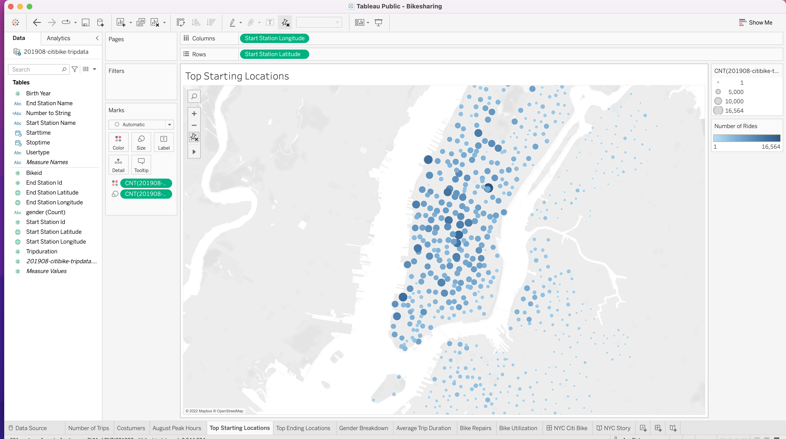

# Bike-sharing in Des Moines

View the storyboard of this project on [Tableau](https://public.tableau.com/app/profile/ana.bisker/viz/Bikeshare_Challenge_16511674447930/BikesharingAnalysis).

## Overview

### Initial approach

An enjoyable two-week trip to New York City in the summer sparked an idea for a promising, profitable and sustainable enterprise. 

We found bike-sharing to be a sustainable and effective way to navigate the metropolis. Using Citi Bike in New York, we were able to get to know the city, interact with people that live there and use bikes for their daily commutes, and really feel alive and connected - and not emitting one ounce of carbon monoxide.

As a result, we returned home to Des Moines, Iowa and decided to explore the idea of starting a similar bike-sharing business in Downtown Des Moines. In order to pitch the idea to angel investors, we needed to compose a solid business plan.

We are undertaking the process of building this entrepreneurial proposition keeping in mind that the mechanics of a plan for Des Moines must be different than the existing structure in New York City. We are aware that the needs are distinct for each city, and will be taking in consideration what needs to be reformulated, and what can be transposed.

With our background in data analytics, we know that to plant the seeds for our local business plan, we need to use comprehensive analysis on data from a functioning and well-oiled corporation as a base from which we might copy or refurbish ideas, and make it work well in our case.

### Programmatic Execution

##### Data Source

We found out that Citi Bike data that has been released to the public and decided to use it for our analysis. Since August is a beautiful time of the year to rent a bike, we wanted to use this data from this summer month as a starting point to determine how many rides we could expect in the city of Des Moines. We downloaded a CSV file with August 2019 data from the [Citi Bike System Data page](https://www.citibikenyc.com/system-data).

This data includes the following fields:

- Trip Duration (seconds)
- Start Time and Date
- Stop Time and Date
- Start Station Name
- End Station Name
- Station ID
- Station Lat/Long
- Bike ID
- User Type (Customer = 24-hour pass or 3-day pass user; Subscriber = Annual Member)
- Gender (0=unknown; 1=male; 2=female)
- Year of Birth

##### Data Analysis

Using Tableau, we created clean and accessible visualizations of different sorts that provided insight from multiple angles into our data. Altogether, we built a compelling 'slide-show' - or Story, as it is called on Tableau.

Use the link below to view *Bikeshare_Challenge* in our Tableau Public Profile:

https://public.tableau.com/app/profile/ana.bisker

## Results

#### Asking Questions and Creating Visualizations

When starting to perform our analysis, we needed to begin by asking what we need to know in order to create our bike-sharing program in Des Moines, so we can ask those questions of our Citi Bike data. We want to be thorough and to accurately represent what the data is saying.

The first question we would like the data to answer is: 

- How many bike trips were recorded during the month of August? 

  

  We dragged the count of rides from trip data in the csv into the text box generating the total count of trips in August.

  

As we look more into the data we discover more questions that we want answers for:

- What Is the Proportion of Short-Term Customers versus Annual Subscribers?

  

  We see the breakdown of rider types in New York City between Customers and Subscribers - the latter being the majority of rides. This will help us predict the customer breakdown in Des Moines and, in turn, propose a better business model to investors.
  

We continue to ask more questions of out Citi Bike data.

- What Are Peak Riding Hours in the Month of August? 

  

  The peak usage hours for the month of August is a key piece of data. This will help us get a better idea of how many bikes we might need in Des Moines, as well as figure out during which parts of the day we'll need the most bikes. For example, if we need to do maintenance on a bike, knowing the peak usage hours will help us plan for the best time to do that. This analysis will also help our investors get a ballpark estimate of how many bikes we might need in Des Moines. 

  Peak hours of CitiBike usage in NYC in August, 2019 were around 8 and 9 am morning hours. Around noon, we see a new peak increasingly until the highest peak of the day, between 5 and 6 pm.

  

- What are the highest-traffic locations? 

  - What Are the Top Bike Stations in the City for Starting a Journey?

    

    

  - What Are the Top Bike Stations for Ending a Journey?

    

    Understanding both when and where people use Citi Bike will help plan our pilot for the Downtown Des Moines bike-sharing program. On the map diagrams above we used circles of increasing sizes and darkening hues indicating a higher concentration ride counts. These images help us visualize the top locations where bike journeys begin and end amongst Citi Bike customers. We can see that the areas with higher concentration of tourists (Manhattan) show the highest number of rides.

- What is the breakdown of gender amongst the bike riders?

  

  Some information about the population can tell us more about the riders themselves. Often, the first place we start when understanding a population is gender.

  

- What is the correlation between age (measured in birth years) and trip duration?
  
  

  Another datapoint that is illuminating is the age of the population, and how that affects bike usage, in our particular case. In this case, overall, it appears that the later the birth year, the longer the ride duration. The general trend is that younger riders tend to use the bikes for longer periods of time. 

  

#### Tableau Story

On the Tableau story that we created, we put together some additional visualizations, to help them determine whether they should invest in a bike-sharing program in Des Moines. Screenshots of those dashboards can be seen below:

##### Trip Duration & Gender Breakdown

On this first dashboard we included two tables. The first table shows data distribution for general users. The second table shows users according to gender, and the breakdown of genders of the whole total rides.

We can see what happens during the first three hours of bike rentals. On the first graph, the trip duration for all users, and on the second one, the duration according to gender. 

It seems that most trips last for less than ten minutes. When compared by gender, the males follow that trend, whereas with females the majority will preserve the trend but they will tend to have more trips that last longer -  like 20 to 30 minutes. Unknown gender represents a smaller fraction of riders, and the trip durations are more evenly distribute within 0-30 minutes-range.

##### Weekly Flux Per Hour

In this visualization, we graphed the number of bike trips by weekday for each hour of the day.

This heatmap shows the flux of start times of bike rentals  hour by hour, and the stoptimes per day of the week.

Trips that begin at 5pm will mostly happen on Mondays, Tuesdays and Thursdays - the latter being the most common of all. Morning trips are more ore less evenly distributed, within the morning peak hours, amongst the days of the work week. During weekends, the peak hours are not as distinct, and there are significantly less rentals starting in the early morning.

##### Weekly Flux per Hour by Gender

In this visualization, we graphed the number of bike trips by gender for each hour of each day of the week.

This heatmap shows the flux of bike rentals with start times hour by hour, with stoptimes throughout the week, separated by gender.

The general pattern in this heat map follow the ones seen in the previous heat map. When separated by gender, we can see that females have less numbers (per the discrepancy of males vs females in this particular dataset) but are generally following the same patterns. Unknown gender is more homogenously distributed, and does not follow the same pattern of distribution per hour.

##### Weekly Flux per User Type by Gender

In this visualization, we created a heat map that shows the number of bike trips broken down by gender for each day of the week by Usertype.

This heat map is our last visualization with Citi Bike data. It shows the flux of  start times of bike rentals per weekday, dividing  users in two groups - customers and subscribers - and categorizing  by gender. 

Male subscribers compose the largest bulk of rides. Within this group, Thursdays seem to be the most popular day for bike rentals.

## Summary

##### Wrapping Up

Seeking out system data from the Citi Bike website proved to be a fruitful resource. 

Combining the powerful visual and descriptive tools of Tableau with our rigorous commitment to transparency, honesty and diligence; we were able to apply concepts of data science, generate questions that produced analytic material that will be constructive and useful in our future steps. 

Arriving at the culmination of this stage of the project, we believe that we can be making the plan of replicating Citi Bike's model for Des Moines come much closer to being a reality.

##### Next Steps

Moving on, exploring the unique characteristics Des Moines, Iowa will start becoming our main focus. This is a collage of some ideas and suggestions of where to begin:

There is more analytic work to be done as well, down the road, as we continue to fine-tune our efforts toward bringing investors on board.

Some ideas for future visualizations and studies to be generated:

- Within the analysis of Citi Bikes, we graphed Bike repair and Bike utilization rates to try to gauge what types of bikes may need more maintenance. But we didn't have information about each of the types of bikes. We have Bike ID as one of the measures of our dataset. It would be useful to procure specific information about the types associated with each ID, and then to use that in order to visualize the correlation between type and level of maintenance.
- Obtain the average age and gender distribution of the population in Des Moines. Using statistics on age/ride-duration and gender/ride-duration, determine the types of bikes that are most fit for the length of rides that will be deemed most fit for that population.

